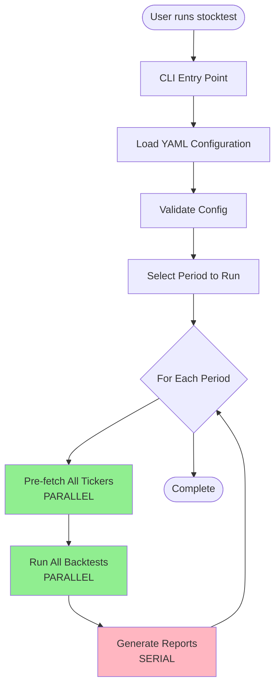
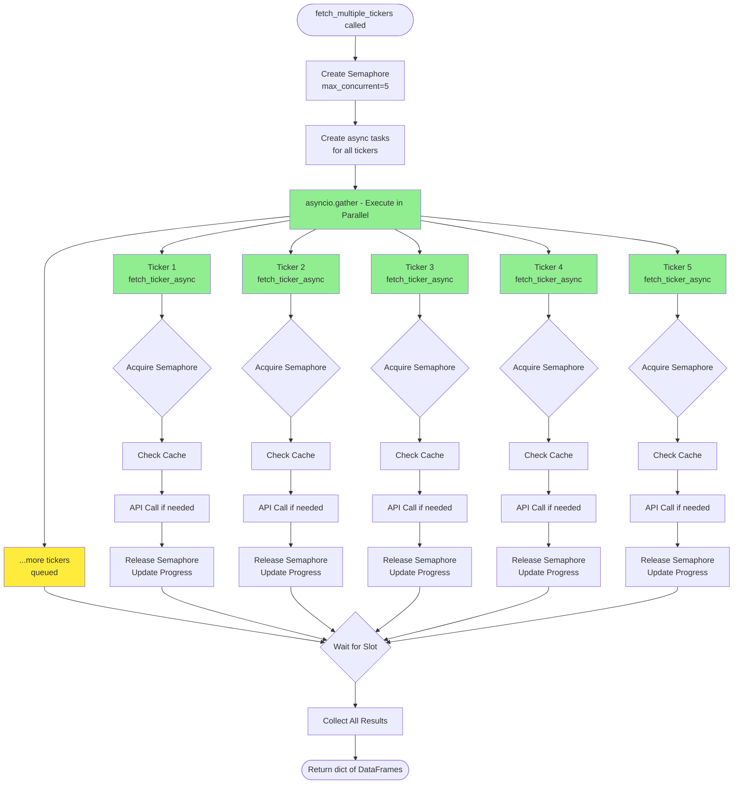
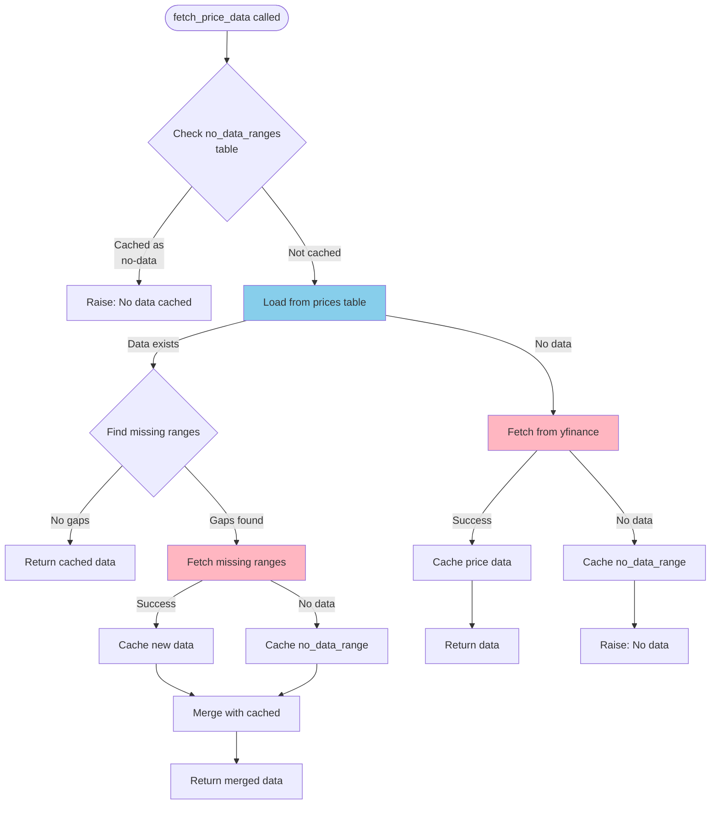
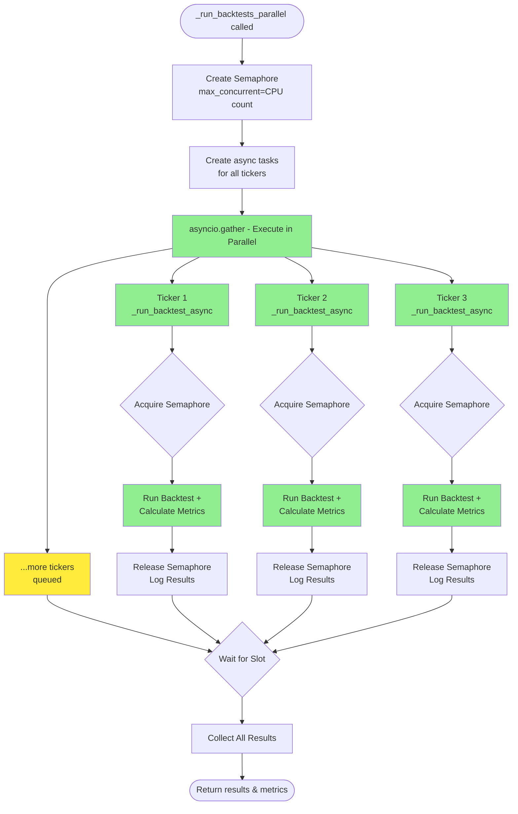
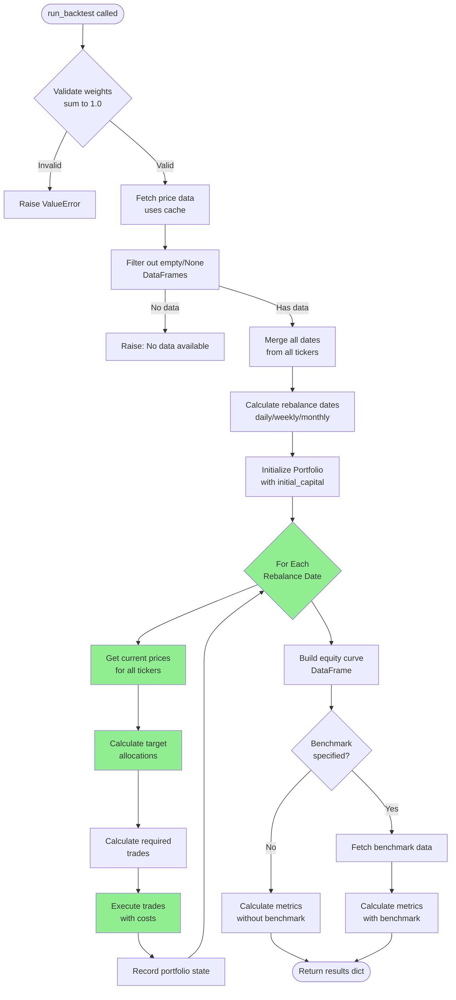
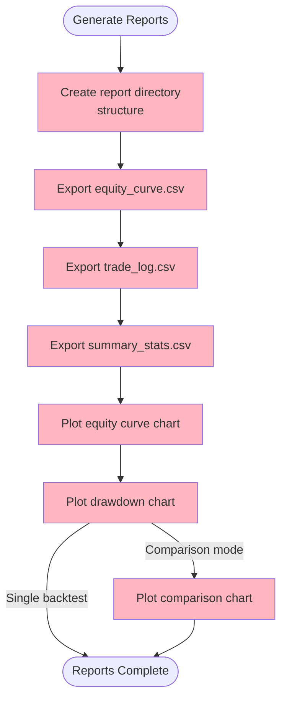

# Stocktest Application Workflow

This document visualizes the execution flow of the stocktest application, highlighting parallel vs serial execution.

## High-Level Execution Flow

## Detailed Data Fetching Flow (Parallel Execution)

## Cache-First Strategy for Individual Ticker

## Parallel Backtest Execution

## Individual Backtest Execution (Called by Parallel Executor)

## Report Generation (Serial)

## Execution Timeline Example

```mermaid
gantt
    title Stocktest Execution Timeline (3 tickers, 2 periods, 8 CPU cores)
    dateFormat SSS
    axisFormat %S.%L

    section Period 1
    Pre-fetch (parallel)          :a1, 000, 2000ms
    Backtest All (parallel)       :a2, after a1, 500ms
    Generate Reports              :a3, after a2, 1000ms

    section Period 2
    Pre-fetch (parallel)          :b1, after a3, 500ms
    Backtest All (parallel)       :b2, after b1, 500ms
    Generate Reports              :b3, after b2, 1000ms
```

## Key Characteristics

### Parallel Execution (GREEN in diagrams)
- **Data Fetching**: Up to 5 concurrent API requests via `asyncio.Semaphore`
  - Progress Tracking: `tqdm` progress bar updates in real-time
  - Concurrency Control: Semaphore prevents overwhelming the API
  - Location: `fetch_multiple_tickers_async()` in `fetcher.py`
- **Backtest Execution**: Up to CPU count concurrent backtests via `asyncio.Semaphore`
  - Each ticker's backtest runs independently in parallel
  - Concurrency Control: Semaphore limits to CPU count for optimal performance
  - Location: `_run_backtests_parallel()` in `cli.py`
- **Within Each Backtest**: Rebalance loop runs serially (state must be chronological)

### Serial Execution (PINK in diagrams)
- **Period Loop**: Each period runs sequentially
- **Report Generation**: Charts and CSVs generated one at a time after all backtests complete

### Cache Strategy (BLUE in diagrams)
- **Check Order**: no_data_ranges → prices table → yfinance API
- **Partial Hits**: Fetches only missing date ranges
- **No-Data Caching**: Prevents repeated failed API calls
- **Persistence**: SQLite database survives across sessions

### Error Handling
- **Per-Ticker Isolation**: Failed ticker doesn't stop others
  - Parallel data fetching: Continues fetching other tickers
  - Parallel backtests: Continues running other backtests
- **Retry Logic**: 3 retries with exponential backoff (up to 60s delay) for API calls
- **Graceful Degradation**: Returns None for failed tickers, continues with successful ones

### Performance Improvements
- **Before parallelization**:
  - 10 tickers @ 2s fetch + 2s backtest each = 40s total
- **After data fetch parallelization only**:
  - 10 tickers @ 2s fetch (parallel, max 5 concurrent) = 4s fetch + 20s backtest = 24s total
- **After full parallelization** (data + backtests):
  - 10 tickers @ 2s fetch (parallel, max 5) + 2s backtest (parallel, 8 cores) = 4s fetch + 3s backtest = **7s total**
  - **~83% faster than original serial execution**
